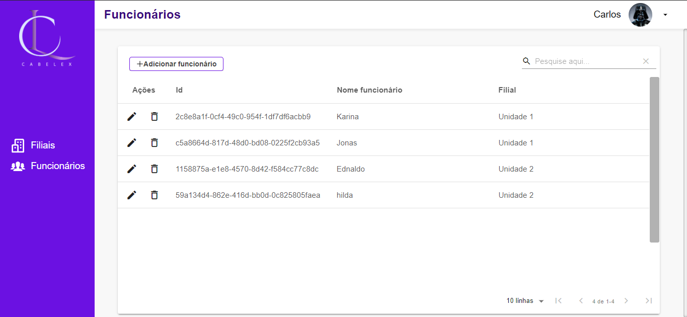
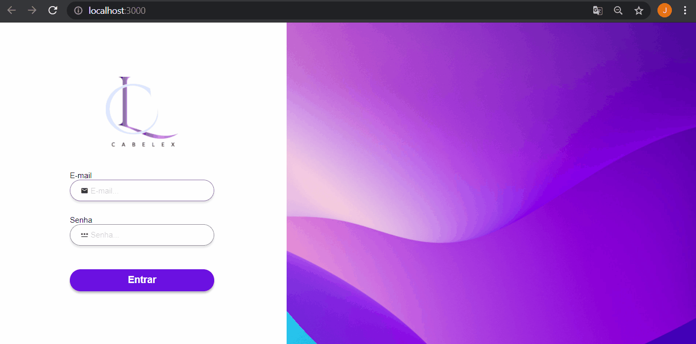
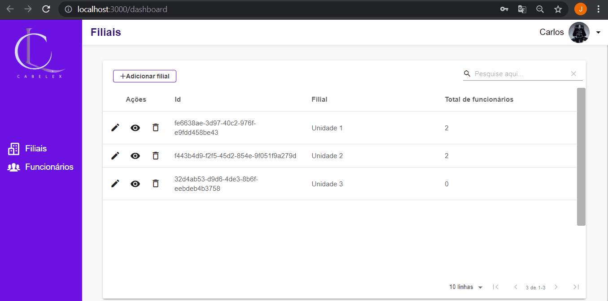
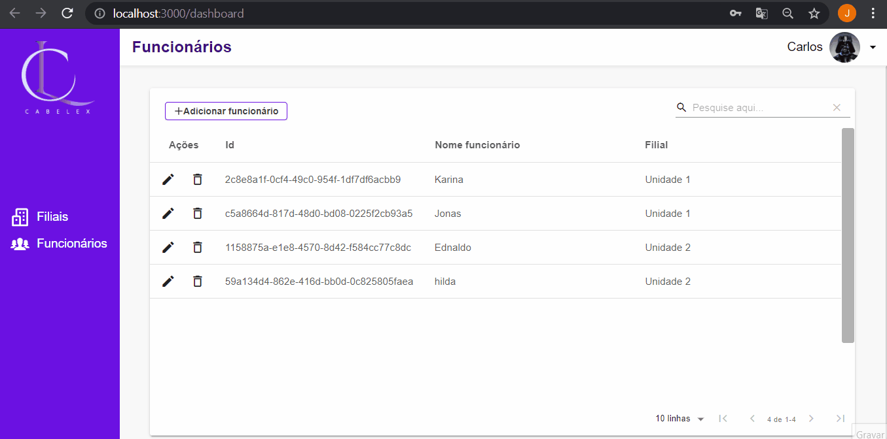

<!-- PROJECT LOGO -->
<br />
<p align="center">
  <h3 align="center">Sistema de funcionários Cabelex</h3>

  <p align="center">
    Site de gerenciamento de funcionários e filiais da empresa de produtos de cabelo Cabelex.
    <br />
  </p>
</p>


<!-- TABLE OF CONTENTS -->
<details open="open">
  <summary>Tópicos</summary>
  <ol>
    <li>
      <a href="#sobre-o-projeto">Sobre o projeto</a>
      <ul>
        <li><a href="#tecnologias-utilizadas">Tecnologias utilizadas</a></li>
      </ul>
    </li>
    <li>
      <a href="#como-instalar">Como instalar</a>
      <ul>
        <li><a href="#pre-requisitos">Pré-requisitos</a></li>
        <li><a href="#instalacao">Intalação</a></li>
      </ul>
    </li>
    <li><a href="#Utilização">Utilização</a></li>
    <li><a href="#autor">Autor</a></li>
  </ol>
</details>


<!-- ABOUT THE PROJECT -->
## Sobre o projeto

<h1 align="center">
  
</h1>

Tela inicial com a exposição dos funcionários de todas as filiais recuperadas da API.

<h1 align="center">
  
  
  
</h1>

### Tecnologias utilizadas

#### Front-end
* [ReactJS](https://pt-br.reactjs.org/)
* [TypeScript](https://www.typescriptlang.org/)
* [Material UI](https://material-ui.com/pt/)
* [Material Table](https://material-table.com/#/)
* [Figma](https://www.figma.com/)
* [SQLite](https://www.sqlite.org/index.html)
* UseContext
* Styled Component
* ReactHooks

#### Back-end

* [Node.js](https://nodejs.org/en/)
* [Typeorm](https://typeorm.io/#/)
* [Express](https://expressjs.com/pt-br/)
* JWT - jsonwebtoken
* Middleware
* Migrations


<!-- GETTING STARTED -->
## Como instalar 

### Pré-requisitos

Para a instalação da aplicação é necessário ter o Node instalado na sua máquina, já o yarn é opcional, segue os comandos para instalação atravé do terminal de comando:
* Node
* Npm ou Yarn

### Instalação 
### Instalação Back-end

* Navegar com o terminal até a pasta Back-end
* executar no terminal o comando abaixo:
    ```sh
    yarn
    ```
* quando finalizar, digite no terminal o comando abaixo:
   ```sh
    yarn dev
    ```
### Instalação Front-end

* Navegar com o terminal até a pasta Front-end
* executar no terminal o comando abaixo:
    ```sh
    yarn
    ```
* quando finalizar, digite no terminal o comando abaixo:
   ```sh
    yarn start
    ```
OU
* Atráves do nmp
  ```sh
  npm install -g
  ```

* Assim criará a pasta node_modules. Em seguida basta digitar:

   ```sh
   npm start
   ```

 ---
 ### Utilização
 Login
 * E-mail Carlos@gmail.com
 * Senha 8995544
 ### ✨Autor

[Jonas de Souza Beserra](https://www.linkedin.com/in/jonas-de-souza-95091b186/)<br/>


[](https://www.linkedin.com/in/jonas-de-souza-95091b186/) 
[](mailto:joonascontato@gmail.com)
